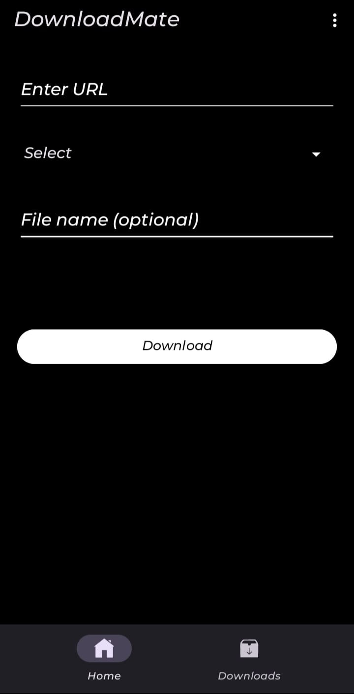
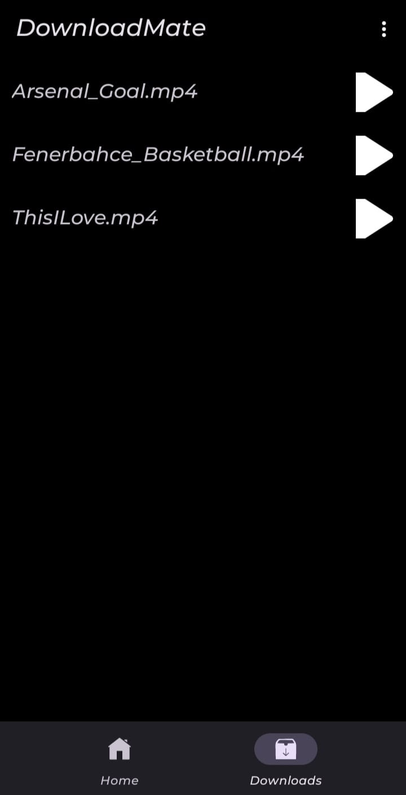
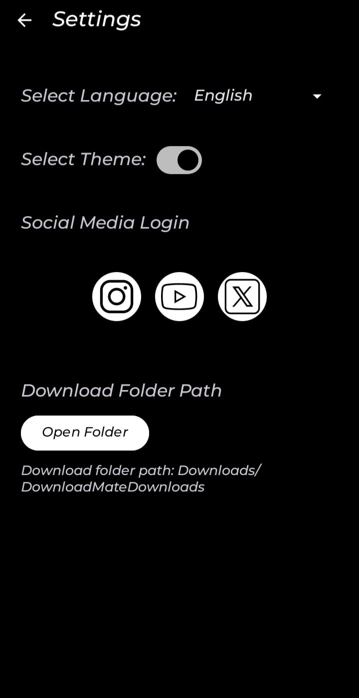
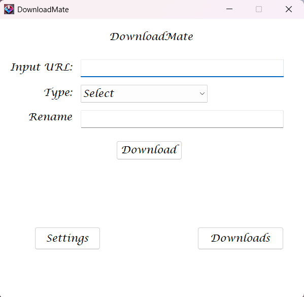
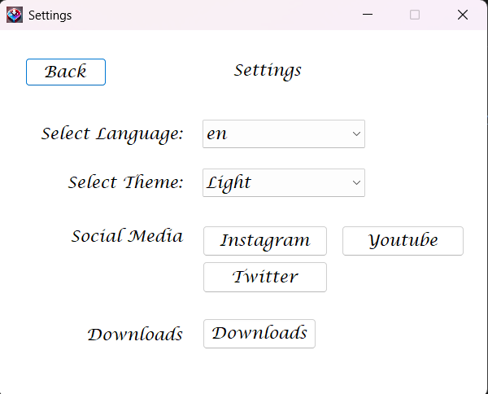

# DownloadMate

DownloadMate is a **multi-platform** media downloader application available for both **desktop** and **mobile** environments. It allows users to download media content (such as videos or music) from social media platforms like YouTube, Instagram, and Twitter — all in a user-friendly interface and with customizable options.

## 🧰 Built With

- 🐍 FastAPI – Media processing API backend
- 📱 Kotlin – Android mobile application
- 💻 C# WinForms – Windows desktop application
- 🔧 yt-dlp, instaloader, ffmpeg – Media download engines

## 🚀 General Features

### 📱 Mobile Application (Android)

  
  
  

- Stylish dark-themed UI.

- Two-tab layout: Home and Downloads.

- Input URL, choose type, and optionally rename file.

- Settings screen includes:

  - Language and theme toggle.
  - Platform login buttons.

- Folder selector to set download path.

- Lists downloaded files with play functionality.

### 🖥️ Desktop Application (Windows - C# Windows Forms)

  
  

- Built using **C# Windows Forms**.
- Clean and minimalist UI with light theme.
- Input URL and select media type (audio/video).
- Rename downloaded file.
- Dedicated settings page with:

  - Language and theme options.
  - Social media login support (Instagram, YouTube, Twitter).
  - List and play downloaded media.
    > ⚙️ Actively being developed and maintained.

## 🛠 Installation

### 📱 Mobile Application (Android)

To install the Android version of **DownloadMate**, follow these steps:

1. Go to the [Releases page](https://github.com/cemlevent54/DownloadMate/releases/tag/v2.0.0-mobile).
2. Download the `.zip` file from the **Assets** section.
3. Extract the downloaded `.zip` file.
4. Inside the extracted folder, locate the `DownloadMate.apk` file.
5. Transfer the `.apk` file to your Android device (via USB, cloud storage, etc.).
6. On your Android device, open the `.apk` file and allow installation from unknown sources if prompted.
7. Complete the installation and launch the app.

> ⚠️ Make sure to enable **"Install unknown apps"** permission for your file manager if installation fails initially.

---

### 🖥️ Desktop Application (Windows)

To install the Windows version of **DownloadMate**, follow these steps:

1. Go to the [Releases page](https://github.com/cemlevent54/DownloadMate/releases/tag/v2.0.0).
2. Download the `.zip` file from the **Assets** section.
3. Extract the downloaded `.zip` file.
4. Inside the extracted folder, find the setup file (e.g., `DownloadMateSetup.exe`).
5. Run the setup file.
6. Follow the installation wizard step by step.
7. Once installed, you can launch **DownloadMate** from the Start Menu or Desktop shortcut.

> ℹ️ The installer may prompt for confirmation depending on your Windows security settings. Accept it to proceed.

---

## 🗺️ Roadmap

- [x] Android App (Kotlin)
- [ ] Windows Desktop App (C# Windows Forms – development in progress)
- [ ] Native platform support for both iOS & Android (React Native)

## 🎥 Demo Video

Click the image to watch demo video!

## 
